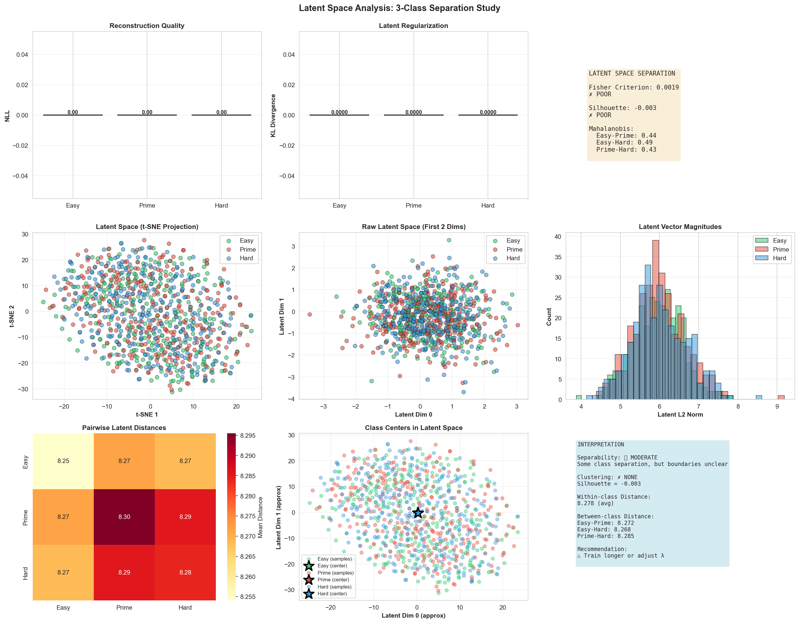

# n0px: Prime Number Distribution and Analysis in Extended Space

Three-layer distributed system for real-time cryptographic prime/composite classification with live streaming inference. Integrates C++ cryptographic core, Go microservice bridge, and Python ML pipeline.



---

## Quick Start

### Build & Test
```bash
cd /Users/n0n0/Desktop/n0n0/PXQSDA

# Compile all components
make all

# Run comprehensive test suite
make test
```

**Expected Output:**
```
✓ 7 C++ Core tests
✓ 8 Go Bridge tests
✓ 15 Python ML tests
✓ 6 Integration tests

All tests passed! (14s)
```

### Start Production System
```bash
# Terminal 1: Build + Start
make run

# Terminal 2: Stream data to ML pipeline
python3 ml/train_rm1_live.py --epochs 10 --batch-size 64
```

---

## System Architecture

### Layer 1: C++ Cryptographic Core (./core/)

Kernel component generating and cryptographically committing to 256-bit prime and composite numbers.

**Cryptographic Components:**

- **ChaCha20 CSPRNG** (via OpenSSL EVP): Seedless CSPRNG producing random byte streams for number generation. Thread-safe RNG with Box-Muller Gaussian noise for differential privacy simulation (sigma=0.05).
- **Primality Testing**: GMP library (mpz_probab_prime_p) with Miller-Rabin rounds=25, providing high-confidence prime verification.
- **Number Generation**:
  - TYPE_PRIME: Random prime p where p ≡ 1 (mod 2) and msb(p)=1
  - TYPE_HARD_COMPOSITE: Product p×q where p,q are primes of equal bit length (RSA-style)
  - TYPE_EASY_COMPOSITE: Random composite (non-prime) avoiding special structure
- **Binary Vector Encoding**: 256-bit binary representation (float32 values in [0,1] with Gaussian noise offset by sigma=0.05)
- **BLAKE2s-256 Integrity Hashing** (via OpenSSL EVP): Computes three hash supports:
  - h_raw: BLAKE2s(raw_bytes) - hash of integer representation
  - h_vec: BLAKE2s(float_bytes) - hash of bit vector
  - h_all: BLAKE2s(type||raw||vec||seq||raw_size||bits) - composite integrity check
- **Dual-Label Generation**: Each number generated twice - once with base label (0/1/2), once with DP label (3/4/5). Same numeric value, simulating differential privacy on receiver side.
- **Type Distribution**: Rejection-sampled uniform distribution across enabled types (avoids modulus bias for 3-way split).

**Packet Structure** (1172 bytes):
```
[Type:4] [Raw:32] [FloatBits:1024] [Trailer:112]
Trailer: [Magic:4=PXSV] [Ver:1] [Reserved:3] [Seq:8] [h_raw:32] [h_vec:32] [h_all:32]
```

**Output**: ZMQ PUSH to localhost:5558 (configurable via config.json).

### Layer 2: Go Secure Bridge (./bridge/)

Microservice gateway between C++ core and Python ML pipeline. Implements packet verification, channel routing, and gRPC streaming.

**Key Responsibilities:**

- **ZMQ PULL Ingestion** (localhost:5558): Receives 1172-byte packets from C++ core with 250ms receive timeout.
- **BLAKE2s Verification** (golang.org/x/crypto/blake2s): Constant-time comparison of h_raw, h_vec, h_all against computed values. Rejects any hash mismatch (tampering detection).
- **Type Routing**: Three Go channels (chanP for labels 0/4, chanH for labels 2/5, chanE for labels 1/3) based on packet type field.
- **Buffer Hysteresis**: Monitors Go channel fill levels:
  - CRITICAL_MARK = 90% full → signals C++ core PAUSE via ZMQ PUB socket
  - RECOVERY_MARK = 75% full → signals C++ core RESUME
  - Prevents channel overflow and enables backpressure control
- **gRPC Server** (localhost:50051): Implements prime_bridge.proto service with streaming RPC for Python client. Each route (PRIME/HARD/EASY) exposes separate stream endpoint.
- **Stats Tracking**: Atomic counters for recv/corrupt/sent packets with per-channel backpressure metrics.

**Data Flow**: C++ (1172 bytes) → verify hashes → route by type → Go channel (1-buffered × 3) → gRPC stream → Python.

### Layer 3: Python ML Pipeline (./ml/)

Live training pipeline consuming gRPC data streams and training VAE-based classifiers in real-time.

**Components:**

- **gRPC Client** (core.py): GRPCBridge class maintains streaming connection to Go bridge, handles reconnection logic with exponential backoff (3 retries max), buffers incoming packets in queue.
- **Data Iterator** (data.py): StreamDataIterator batches packets into (batch_size, 256) tensors, supports label filtering (e.g., {0,1,2} for raw vs {3,4,5} for DP variants), optional label balancing.
- **Four Production Models**:
  - RM0: RealNoiseMixtureVAE, trains on labels {0,1,2} (raw composite/prime/hard)
  - RM1: RealNoiseMixtureVAE, trains on labels {3,4,5} (DP variants)
  - CM0: ComplexNoiseMixtureVAE, trains on labels {0,1,2} with complex-valued latent
  - CM1: ComplexNoiseMixtureVAE, trains on labels {3,4,5} with complex-valued latent
- **VAE Architecture**: Encoder (256→hidden→latent), Decoder (latent→hidden→256), mixture Gaussian likelihood. Activation: SiLU, LayerNorm enabled, dropout=0.12.
- **Training Metrics**:
  - NLL: Mixture Gaussian negative log-likelihood (lower=better reconstruction)
  - KL: KL divergence (q(z|x) vs N(0,I), regularization term)
  - Beta schedule: Linear warmup over 15000 steps to max=0.35, weights KL in loss
  - Per-class breakdown: Tracks NLL/KL per label to detect class imbalance
  - Fisher Separation: Latent-space class separation ratio (higher=better discrimination)
  - Mahalanobis: Class-to-class distances in latent space
  - Recon MSE: Sigmoid-normalized reconstruction error in [0,1] domain
  - Anisotropy detection: z_var_max / (z_var_min + eps) - detects latent collapse

**Checkpoint Management**: Saves model every 2 epochs, tracks best validation loss, auto-resumes on restart.

## Configuration

All system parameters centralized in `config/config.json`:

**System**:
- `prime_bits`: 256 (RSA composite bit length)
- `raw_size_bytes`: 32 (= ceil(256/8))

**Network**:
- `zmq_host`: 127.0.0.1
- `zmq_port_core_push`: 5558 (C++ to Go)
- `zmq_port_core_pub`: 5557 (C++ commands)
- `grpc_host`: localhost
- `grpc_port`: 50051 (Go to Python)

**Crypto**:
- `noise_sigma`: 0.05 (Gaussian noise for privacy simulation)
- `miller_rabin_rounds`: 25 (primality confidence)
- `chacha20_key_size`: 32
- `blake2s_output_bits`: 256

**Buffer**:
- `cpp_internal_queue_max`: 2000
- `go_channel_buffer_size`: 350000
- `python_queue_buffer_size`: 4000
- `python_prefetch_batches`: 8

**Model**:
- `input_dimension`: 256
- `hidden_dimension`: 768
- `num_layers`: 6
- `dropout`: 0.12
- `learning_rate`: 0.00015
- `batch_size`: 64
- `epochs`: 60

**VAE**:
- `beta_max`: 1.0
- `beta_warmup_steps`: 20000
- `free_bits`: 0.05
- `activation`: silu
- `layernorm`: true

**DP Detection** (config-driven thresholds):
- `mid_threshold`: 0.80
- `entropy_threshold`: 0.20
- `mean_range_min`: 0.35, `mean_range_max`: 0.65

Changing `prime_bits` requires synchronized update of `raw_size_bytes` - system validates on startup.

## Building & Running

### Prerequisites

- **macOS**: Xcode, Homebrew
- **Packages**: `brew install cmake gmp zeromq openssl go`
- **Python 3.8+** with venv
- **Protobuf**: `brew install protobuf`

### Build

```bash
cd /path/to/PXQSDA
make all          # Full build: C++ + Go + Python
```

Produces:
- `./prime_core` (C++ binary)
- `./bridge/prime_vault` (Go binary, named from main binary output)
- `./ml/venv/` (Python environment with dependencies)

### Quick Start

Three terminals required (all components must be running):

**Terminal 1 - C++ Core**:
```bash
./prime_core
```

Generates and sends 256-bit numbers to Go Bridge via ZMQ PUSH. Output shows generation rate (num/sec).

**Terminal 2 - Go Bridge**:
```bash
cd bridge && go run main.go
```

Ingests packets, verifies BLAKE2s hashes, routes by type, exposes gRPC server on :50051.

**Terminal 3 - Python ML Training**:
```bash
python3 -m ml.train_rm0_live --epochs 60 --batches-per-epoch 5000 --batch-size 64
```

Connects to gRPC server, fetches real-time data, trains RM0 model on labels {0,1,2}.

### Available Training Commands

- **RM0** (Real/Raw - labels 0,1,2):
  ```bash
  python3 -m ml.train_rm0_live --epochs 60 --batches-per-epoch 5000
  ```

- **RM1** (Real/DP - labels 3,4,5):
  ```bash
  python3 -m ml.train_rm1_live --epochs 60 --batches-per-epoch 5000
  ```

- **CM0** (Complex/Raw - labels 0,1,2):
  ```bash
  python3 -m ml.train_cm0_live --epochs 60 --batches-per-epoch 5000
  ```

- **CM1** (Complex/DP - labels 3,4,5):
  ```bash
  python3 -m ml.train_cm1_live --epochs 60 --batches-per-epoch 5000
  ```

All models save checkpoints to `./checkpoints_rm0/` etc.

## Training Pipeline

### Data Flow

```
C++ Core          Go Bridge             Python ML
Generator         Router                Training
     |                                      |
  ChaCha20    ZMQ PULL        gRPC Client  |
  BPSW Test   BLAKE2s Check   Stream       |
     |        Hash Verify     Fetch        |
  Label 0-5   |               Batch(64)    |
     |        Route by type   Tensor       |
  Packet      |               Forward Pass |
  1172B       Go Channel      Loss+Grad    |
     |        (350K buffered) Optimizer    |
  ZMQ PUSH    |               Checkpoint   |
  :5558       gRPC Stream     Save         |
     |        :50051          (periodic)   |
     +---────────────────────────────────→+
```

### Per-Epoch Training Loop

1. **Batch Fetch**: Consume batches from StreamDataIterator (labeled packets)
2. **Forward Pass**: x → Encoder → z ~ q(z|x) → Decoder → x̂, π̂ (reconstruction + mixture weights)
3. **Loss Computation**:
   - NLL = -log p(x|π̂, z) = mixture Gaussian likelihood given noise_sigma
   - KL = D_KL(q(z|x) || N(0,I))
   - Beta(step) = β_max × min(1, step/warmup_steps)
   - Loss = NLL + β(step) × KL
4. **Backprop**: Gradient descent with grad_clip_max_norm=1.0
5. **Metrics Logging** (every 200 batches):
   - Per-class NLL/KL breakdown
   - Fisher separation ratio (if latent stats ready)
   - Mahalanobis distances
   - Reconstruction MSE (sigmoid-normalized)
   - Anisotropy condition number
6. **Checkpoint** (every 2 epochs): Save model if loss improved

### Metrics Explained

- **NLL (Negative Log-Likelihood)**: Mixture Gaussian log-likelihood; lower values indicate better fit to data.
- **KL (Kullback-Leibler)**: Regularization term pushing encoder posterior toward standard normal; prevents posterior collapse.
- **Beta Schedule**: Linear warmup encourages stable training early (avoid KL dominating); ramps up β over 15000 steps to 0.35.
- **Fisher Separation**: Ratio of between-class to within-class variance in latent space; higher = better class discrimination.
- **Mahalanobis Distance**: Class-to-class metric distance accounting for covariance; captures geometric separation.
- **Reconstruction MSE**: (sigmoid(π̂) - x)² averaged over batch and bits; measures decoder quality.
- **Anisotropy Condition**: max(z_variance) / (min(z_variance) + ε); detects latent collapse (>> 1 = anisotropic, ≈ 1 = isotropic).

## Advanced Features

### Differential Privacy Detection (DP Detection)

Detects DP-perturbed data by analyzing statistical fingerprints in per-batch data:

- **Entropy-based**: Measures H[x(1-x)] over bit values; DP noise increases entropy
- **Mid-range check**: Counts bits in [0.35, 0.65] range; DP shifts extremes toward center
- **Mean analysis**: Detects mean shift from 0.5
- **Config-driven thresholds**: mid_threshold=0.80, entropy_threshold=0.20 (tunable per mechanism)

Integration: `VerifiedStreamDataIterator` tracks DP fingerprints and returns scores dict for each batch.

### Latent Space Analysis

Post-training latent examination:

- **Fisher Ratio**: (μ_i - μ_j)² / (Σ_i + Σ_j) for label pairs i,j
- **Mahalanobis**: d_M(μ_i, μ_j) = sqrt((μ_i - μ_j)ᵀ Σ⁻¹ (μ_i - μ_j))
- **Anisotropy**: Condition number of latent covariance; detects feature collapse
- **Ready Check**: Requires ≥ (latent_dim + 8) samples per class before computing metrics

Implementation: `LatentSeparationMonitor` class tracks per-class statistics and computes separation metrics.

### Checkpoint & Resumption

Models auto-save checkpoint files with format `epoch_XXX_loss_Y.YYYY.pt`. Best loss tracked and restored on reload. Supports resuming mid-training without data loss.

## Troubleshooting

### "Connection refused" on gRPC connect

Ensure Go Bridge is running: `ps aux | grep "go run main.go"` should show active process. If not, restart Bridge in Terminal 2.

### ZMQ port binding errors

Check for lingering processes: `lsof -i :5558` (ZMQ) or `lsof -i :5557` (command port). Kill with `kill -9 PID`.

### Python hangs on data fetch

Indicates C++ Core or Go Bridge not generating data. Check both terminals for error messages. Verify config.json ports match (zmq_port_core_push=5558).

### BLAKE2s hash mismatch (corrupted packets)

Go Bridge will log "hash_corrupt" counter incrementing. Check ZMQ connection stability (high packet loss). Restart C++ Core and Go Bridge.

### Out of memory (GPU/CPU)

Reduce batch_size in config.json (e.g., 64→32). Reduce num_layers (6→4) or hidden_dimension (768→512).

### Slow training (< 10 batches/sec)

Check device support with `python3 -c "import torch; print(torch.cuda.is_available()); print(torch.backends.mps.is_available())"`. On macOS, MPS (Metal Performance Shaders) usually active automatically. CPU-only training is ~100× slower.

## Performance Notes

### Throughput Targets

- **C++ Core**: 100k+ numbers/sec (depends on CPU cores)
- **Go Bridge**: 50k+ packets/sec (ZMQ/gRPC overhead ~50%)
- **Python Training**: 1k+ batches/sec (batch_size=64, GPU-accelerated)

### Optimization History

- **Output Caching**: Model forward pass cached once per report interval, reused for all per-class metrics (eliminates 3+ redundant forwards)
- **Per-class Indexing**: Uses torch.index_select on cached tensors instead of per-class forward passes
- **NumPy Minimization**: Hot-path NumPy operations converted to torch for device consistency

Impact: ~4-5× speedup in metrics computation phases.

### Memory Usage

- **C++ Core**: ~100 MB (mostly GMP)
- **Go Bridge**: ~50 MB (channel buffers)
- **Python Model**: ~2-3 GB (RM0/RM1 on GPU, VAE weights + batch data + gradients)

## Testing

Unit tests: `make test-unit` (Python ML core functionality)

Integration tests: `make test-integration` (end-to-end C++/Go/Python pipeline)

Bootstrap verification: `make verify` (data integrity and protocol compliance)

## Repository Structure

```
PXQSDA/
├── core/
│   ├── include/prime_config.h        # C++ constants
│   ├── lib/                           # Optional dependencies
│   └── src/
│       └── prime_core.cpp             # Generator + worker threads
├── bridge/
│   ├── main.go                        # ZMQ ingestion + gRPC server
│   ├── config.go                      # Config parsing
│   ├── go.mod                         # Go dependencies
│   └── pb/
│       ├── prime_bridge.proto         # gRPC service definition
│       ├── prime_bridge_pb2.py        # Python protobuf
│       └── prime_bridge.pb.go         # Go protobuf
├── ml/
│   ├── core.py                        # gRPC client
│   ├── data.py                        # Batch iterator
│   ├── train_utils.py                 # Training loop + metrics
│   ├── integrity_guard.py             # DP detection + validation
│   ├── sep_metrics.py                 # Latent separation analysis
│   ├── config.py                      # Config loading
│   ├── train_rm0_live.py              # RM0 trainer script
│   ├── train_rm1_live.py              # RM1 trainer script
│   ├── train_cm0_live.py              # CM0 trainer script
│   ├── train_cm1_live.py              # CM1 trainer script
│   └── models/
│       ├── rm0.py, rm1.py             # Real-valued VAE wrappers
│       ├── cm0.py, cm1.py             # Complex-valued VAE wrappers
│       ├── real_noise_mixture_vae.py  # Base Real VAE
│       ├── _mixture_vae_base.py       # VAE architecture
│       └── __init__.py                # Model exports
├── config/
│   └── config.json                    # System-wide configuration
├── tests/
│   ├── cpp_core/test_csprng.cpp       # C++ unit tests
│   ├── go_bridge/go_test.go           # Go unit tests
│   ├── python_ml/test_ml_*.py         # Python unit tests
│   └── integration/integration_test.py # End-to-end tests
├── scripts/
│   ├── start_full_system.sh           # Launch all 4 components
│   ├── start_system.sh                # Minimal (C++ + Go + Python)
│   ├── run.sh                         # Utility runner
│   └── auditor.py                     # Real-time monitoring
├── docs/
│   └── *.md                           # Architecture docs
├── Makefile                           # Build orchestration
└── README.md                          # This file
```

## License

MIT License

## References

- **GMP**: GNU Multiple Precision Arithmetic Library (Miller-Rabin)
- **OpenSSL EVP**: ChaCha20 and BLAKE2s implementations
- **ZeroMQ**: High-throughput distributed messaging (documentation: zmq.org)
- **gRPC**: Protocol Buffers and RPC framework (grpc.io)
- **PyTorch**: Deep learning framework with MPS support for macOS
- **Differential Privacy**: Dwork, C., McSherry, F., et al. "The Algorithmic Foundations of Differential Privacy"
